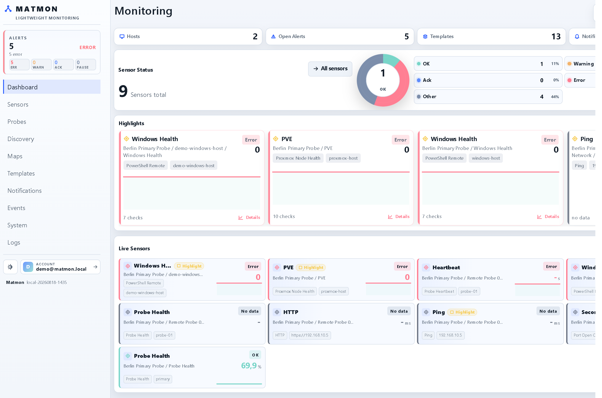
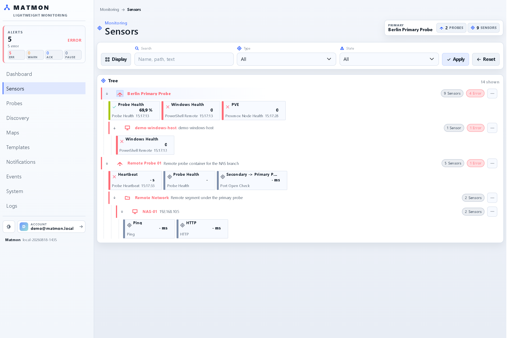
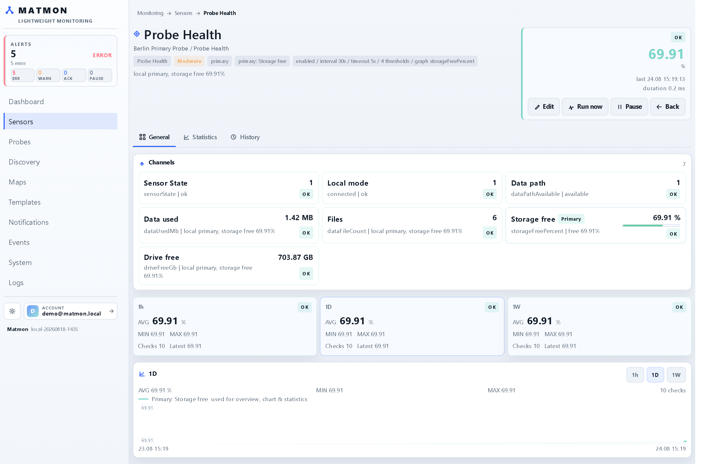
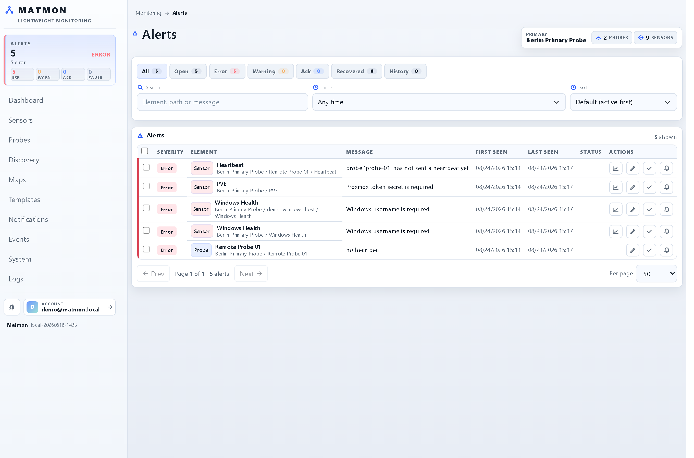
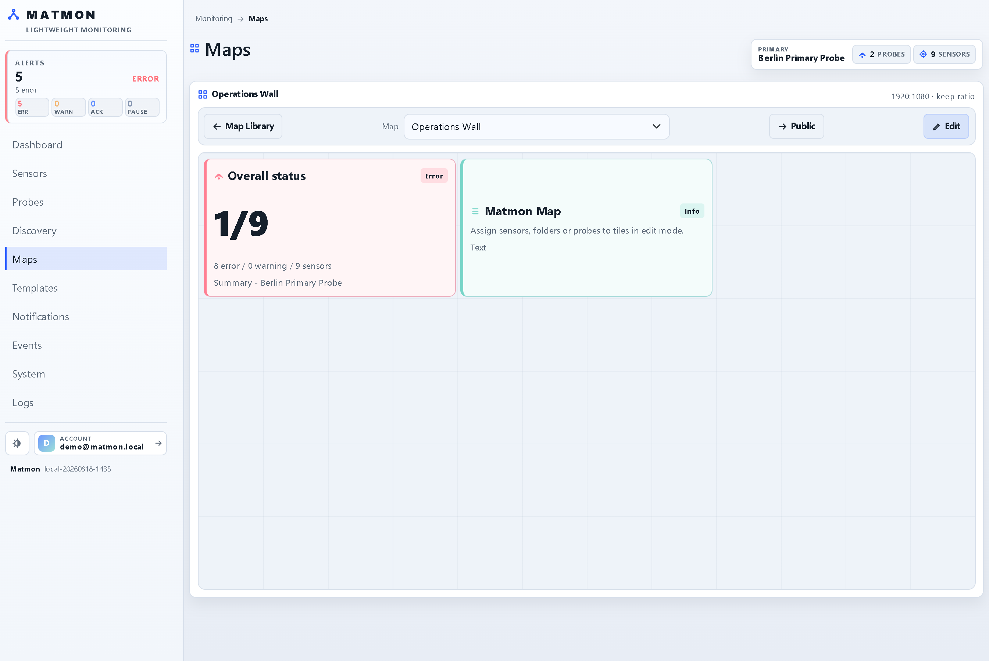
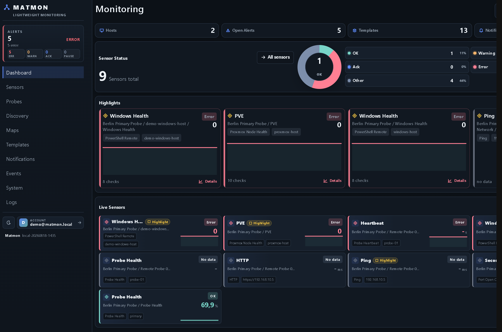
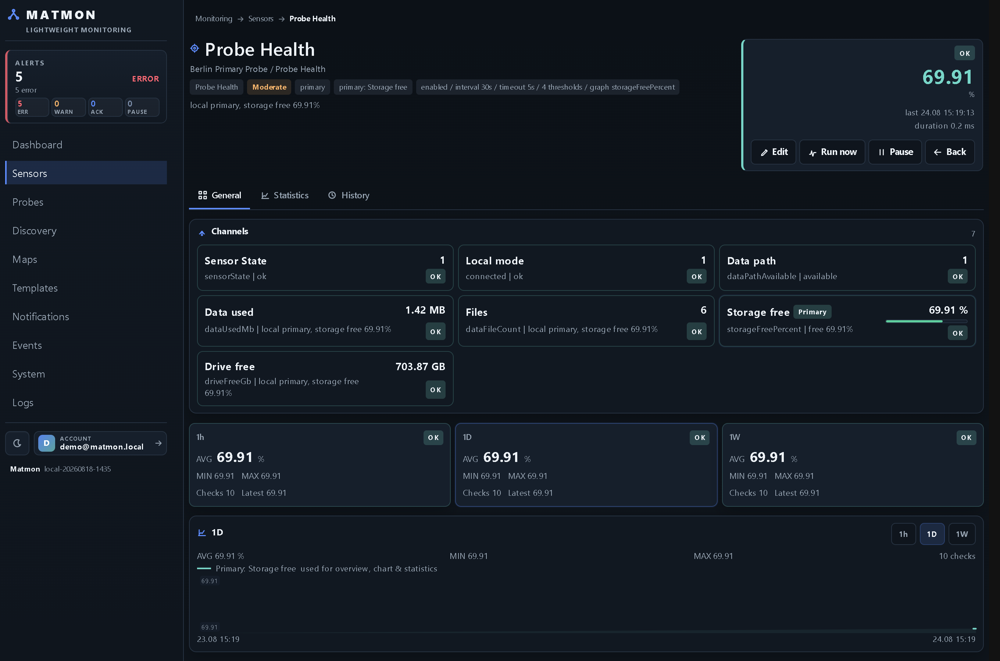
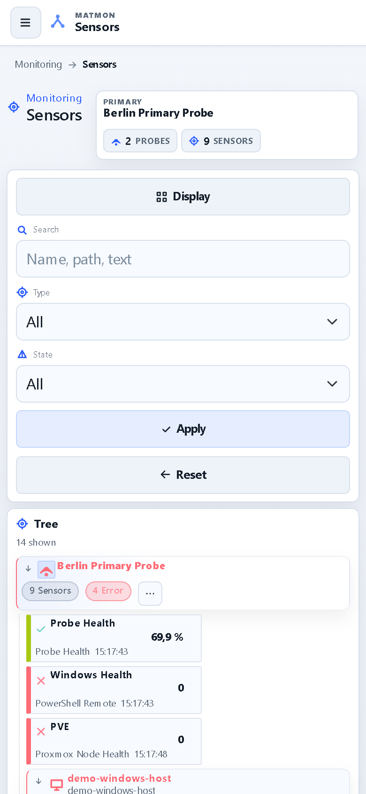
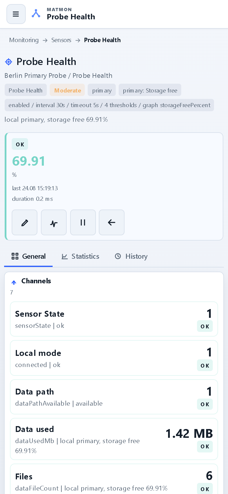

<div align="center">


# Matmon

**Lightweight network & infrastructure monitoring — self-hosted, in one container.**

Probes, hosts, sensors, templates, per-channel thresholds, alerts, notifications and maps.
One primary, optional remote probes behind NAT, no cloud required.

</div>



---

## What this is about

Matmon is a compact, self-hosted alternative to the classic monitoring suites — small enough to
run at home or in a small-business network, but built around the same ideas: a tree of **probes →
hosts → sensors**, settings and credentials that **inherit** down the tree, **templates** for
reusable setups, **per-channel thresholds**, alerts that **persist until acknowledged**, and
notifications that actually get delivered. It runs as a single container; remote probes are
optional and connect outbound, so they work behind firewalls and NAT.

## At a glance

**Monitoring model**
- A tree of **probes, folders, hosts and sensors**; settings, schedules and credentials **inherit**
  from parents, and a sensor overrides only what differs
- **Templates** (copy + origin, with "restore from template"), free-form **tags** that cascade, and
  a searchable element picker everywhere a target is chosen
- **Per-channel thresholds** with sensible built-in defaults, and **schedules** (every N, daily,
  weekly on several days, monthly) with a live "next runs" preview
- Accurate **downsampled statistics** per channel (avg / min / max / percentiles / uptime), kept in
  an embedded SQLite store

**Sensors** (a selection)
- Reachability & web: **Ping, HTTP(S), TCP port, DNS, NTP, SSL certificate** (+ chain)
- Platforms: **Synology, Proxmox** (cluster + per-node), **VMware/vSphere, UniFi**, Windows /
  Linux (SSH) / **health & disk & update** sensors
- Data & services: **MSSQL, PostgreSQL, MySQL/MariaDB, Docker, Windows Event Log, Mail round-trip**
- Scripting: **PowerShell Remote, Local Script, Local Program** (allow-listed)

**Alerts & notifications**
- Alerts are **Alerta-style**: they stay until acknowledged, with **mute** (timed or permanent) and
  a recovery state
- **E-mail** delivery with anti-spam throttling and recovery mails, a **scheduled summary report**
  and a customer-ready **PDF audit report**
- Optional **cloud alert relay** as just another notification sender

**Operations**
- **Remote probes** connect outbound to the primary — no inbound ports at the remote site
- **Maps / wallboards** with tiles that roll up sensor state (element- or tag-targeted)
- **Dark & light** themes, a mobile-responsive UI, users with **Viewer / User / Admin** roles and
  optional two-factor sign-in
- Optional **Matmon.Cloud** link for an off-site dead-man-switch, config backup, remote access and
  licensing — entirely opt-in; empty means fully offline

## Screenshots

### The monitoring tree



Everything under one tree. State, tags and inherited settings are visible at a glance, and the
search box matches names, targets and tags.

### A sensor in detail



Each sensor breaks down into **channels** with their own thresholds and visuals, rolling
**1h / 1d / 1w** summaries, and a history graph. Actions (run now, pause, edit) sit in one row.

### Alerts



Filter by state, search, acknowledge or mute. Alerts persist until someone acts on them, so a
short outage in the night is still waiting in the morning.

### Maps & wallboards



Lay out tiles that aggregate the worst state of a sensor, folder, probe or tag — and open a map
full-screen as a public wallboard for a TV.

### Dark theme

| Dashboard | Sensor detail |
|---|---|
|  |  |

### On a phone

| Monitoring | Sensor detail |
|---|---|
|  |  |

## Quick start

Ready-made images are published to the GitHub Container Registry:

| Tag | Built from | Use it for |
|---|---|---|
| `ghcr.io/real-ttx/matmon:latest` | `main` | releases |
| `ghcr.io/real-ttx/matmon:nightly` | `dev` | the newest features |

### 1. Just run it

Copy this into `docker-compose.yml` and start it — nothing else needed:

```yaml
services:
  matmon:
    image: ghcr.io/real-ttx/matmon:latest
    container_name: matmon
    restart: unless-stopped
    ports:
      - "8099:8099"
    volumes:
      - matmon-data:/app/data

volumes:
  matmon-data:
```

```bash
docker compose up -d
```

Open **http://localhost:8099** — on first start a short **setup wizard** creates your admin
account (health check: `/healthz`). Everything Matmon keeps lives in the single `matmon-data`
volume, so an update is just `docker compose pull && docker compose up -d`.

Without Compose:

```bash
docker run -d --name matmon -p 8099:8099 -v matmon-data:/app/data \
  ghcr.io/real-ttx/matmon:latest
```

### 2. Add a remote probe

A remote probe (secondary) runs the same image in `Secondary` mode and connects **outbound** to
the primary, so it needs no inbound port at the remote site. Give it a unique id + token and point
it at your primary:

```yaml
  probe:
    image: ghcr.io/real-ttx/matmon:latest
    container_name: matmon-probe
    restart: unless-stopped
    environment:
      Matmon__Mode: Secondary
      Matmon__ProbeId: probe-01
      Matmon__ProbeName: Remote Probe 01
      Matmon__ProbeToken: change-me-to-a-secret
      Matmon__PrimaryUrl: http://your-primary-host:8099
```

The probe then appears in the tree; assign sensors to it and it executes them from its own network.

### 3. From source

The repository's `docker-compose.yml` also carries a `build:` section, so you can build the image
locally instead of pulling it:

```bash
docker compose up -d --build
```

For a full development stack (primary + a sample probe, workspace bind-mounted to `./data`) use the
dev compose:

```bash
docker compose -f docker-compose.dev.yml up -d --build
#   primary → http://localhost:8099   sample probe → http://localhost:8100
```

## Configuration

Matmon is configured **in the UI** — the environment only carries a few bootstrap settings, and all
of them are optional:

| Variable | Default | Meaning |
|---|---|---|
| `Matmon__Mode` | `Primary` | `Primary`, `Secondary` (remote probe) or `Executor` |
| `TZ` | – | Time zone for timestamps |
| `Matmon__Auth__Username` / `Matmon__Auth__Password` | – | Pre-provision an admin and skip the setup wizard |
| `Matmon__CloudHeartbeatIntervalSeconds` | `30` | How often the primary checks in with Matmon.Cloud (if linked) |
| `Matmon__AllowedProgramPaths` | – | Allow-list for the *Local Program* sensor (`;`-separated) |
| `Matmon__WorkspacePath` | `data/workspace.json` | Where state is stored (inside `/app/data`) |

Secondary probes additionally take `Matmon__ProbeId`, `Matmon__ProbeName`, `Matmon__ProbeToken`
and `Matmon__PrimaryUrl` (see the remote-probe example above). The Matmon.Cloud link is set up in
**System → Cloud** in the UI, not through the environment.

### The `/app/data` volume

Everything Matmon owns lives under one directory — one volume to back up or move:

```
/app/data
├─ workspace.json          topology, templates, notifications, maps, users, settings
├─ telemetry.db            SQLite: observations, events, statistics (WAL)
├─ dataprotection-keys/    encryption keys (credentials + secrets at rest)
└─ backups/                local config backups
```

> **Upgrading from the old three-volume layout?** Earlier compose files split this into
> `matmon-data`, `matmon-backups` and `matmon-keys`. That still works — keep those mounts — but a
> fresh install only needs the single `matmon-data:/app/data`. To consolidate, copy the contents of
> the old `-backups`/`-keys` volumes into `backups/` and `dataprotection-keys/` under the data
> volume before switching (keep the keys, or credentials stored on that instance become unreadable).

### Backup, restore & moving to a new host

Matmon can back up its **configuration** to a local file or push it off-site to Matmon.Cloud
(System → Config → Backup, or a scheduled backup job). A config backup contains the full
**topology** (probes, folders, hosts, sensors), **templates**, **notifications** and **maps** — but
**not** telemetry and **not** the local user accounts (so a restore can never lock you out).

Secrets (credentials, tokens) are encrypted with the instance's own keys. Restoring on the **same**
instance recovers them as-is; restoring on a **different** instance recovers the configuration but
drops the secrets — unless you set a **passphrase** when creating the backup, which re-seals the
secrets so they travel with it.

**Moving the primary to a new host:** install Matmon there, restore the config backup (a passphrase
backup brings the credentials too), then re-point each **remote probe** at the new primary by
updating its `Matmon__PrimaryUrl` (and keeping its `ProbeId`/`ProbeToken`) — the probes themselves
come back with the restored topology.

## Architecture

Matmon runs in one of three modes (`Matmon__Mode`):

- **Primary** owns the UI, configuration, alerts, history and global state, and runs the polling
  loop for its local sensors.
- **Secondary** is a remote probe: it connects **outbound** to the primary, pulls the sensor work
  assigned to it, executes it from its own network and posts results back — no inbound ports.
- **Executor** is a stateless sensor-runner used by Matmon.Cloud's cloud sensors (no UI, no state).

Elements form a tree — `Probe → Folder → Host → Sensor` — where settings, schedules and credentials
inherit from parents and templates, and any element overrides only the fields that differ.

## Development

Requirements: **.NET 10 SDK** and Docker.

```bash
dotnet build Matmon.slnx                    # build (note: .slnx, not .sln)
dotnet test tests/Matmon.Tests/Matmon.Tests.csproj   # unit tests
./scripts/dev.ps1                           # dotnet watch run → http://localhost:5084
docker compose -f docker-compose.dev.yml up -d --build   # full container stack
```

Key locations: `src/Matmon.Host/Program.cs` (startup, auth, APIs, modes),
`src/Matmon.Host/Services` (polling, probes, persistence, dashboard), `src/Matmon.Host/Pages`
(Razor Pages UI), `src/Matmon.Core/Domain` (domain model, sensor executors).

## Branches & versioning

| Branch | Purpose | Version |
|---|---|---|
| `main` | Release (`:latest`) | `0.<minor>.<build>-<yyyyMMdd>` |
| `dev` | Development (`:nightly`) | `nightly-<build>-<yyyyMMdd>` |
| local | – | `local-<yyyyMMdd>` |

The base version lives in [`VERSION`](VERSION); CI bakes the build number into the image and shows
it in the sidebar footer (linking to `/About`). Images are published to the GitHub Container
Registry.

## License

Matmon is **proprietary** software — see the [LICENSE](LICENSE). Commercial use is governed by the
applicable Matmon product plan (Free / Business / Enterprise). Bundled third-party components keep
their own licenses.
